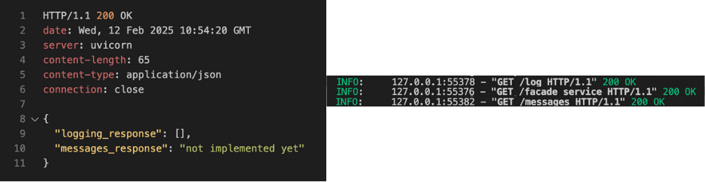
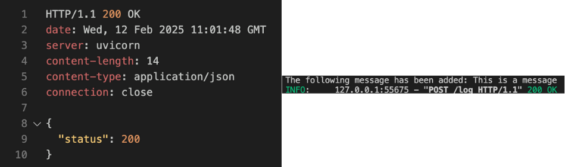
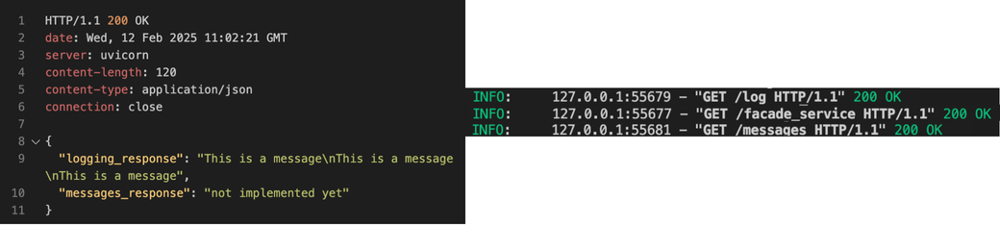
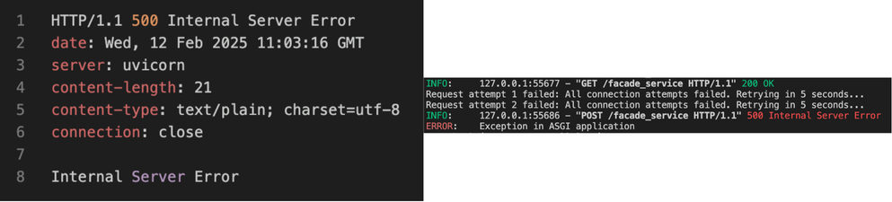
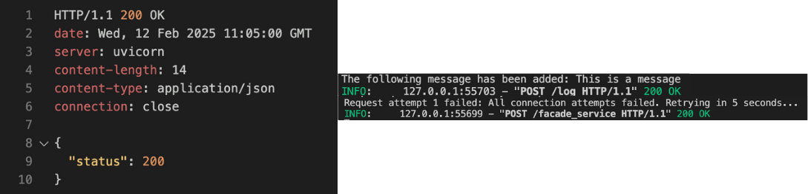

# **Software Architecture - Microservices Basics**

This repository contains a basic implementation of a microservices architecture using both **HTTP REST API** and **gRPC**.  

---

## 📂 **Repository Structure**

The repository consists of two main implementations:  

- **HTTP-based implementation** using REST APIs.  
- **gRPC-based implementation**, located in the `gRPC` directory.  

A `.env` file is used in both implementations to define important variables such as service URLs.  

---

## 🚀 **Usage**

To run the system, you need to launch three microservices on different ports:  

### **1️⃣ Messages Service**
Not implemented yet, returns static text.
```sh
uvicorn messages_service:app --host 127.0.0.1 --port 8082
```

### **2️⃣ Logging Service**
Handles logging messages.

- Using HTTP:
```sh
uvicorn logging_service:app --host 127.0.0.1 --port 8081
```
- Using gRPC
```sh
python3 -m logging_service
```

### **3️⃣ Facade Service**
Acts as a gateway that communicates with both services.
```sh
uvicorn facade_service:app --host 127.0.0.1 --port 8080
```

## 🧪 Testing
To test the services, make sure all three applications (Facade, Logging, and Messages) are running.

You can send requests using the ```tests.http``` file or manually via ```curl``` commands:

### 🔹 GET Request (Fetch messages)
```sh
curl -X GET "http://localhost:8080/facade_service"
```

### 🔹 POST Request (Log a message)
```sh
curl -X POST "http://localhost:8080/facade_service" \
     -H "Content-Type: application/json" \
     -d '{"text": "This is a test message"}'
```

## 📊 Results

Below are the results of various requests with different scenarios.  

- **1️⃣ GET Request - Empty Logging Response**



- **2️⃣ POST Request - Successful Logging**



- **3️⃣ GET Request - Contained Entries**



- **4️⃣ POST Request - Retry Mechanism (Failure)**



- **5️⃣ POST Request - Retry Mechanism (Success)**



## **Additional tasks implemented**

- Retry and deduplication (Both with HTTP and gRPC)
- gRPC
