# SoftwareArchitectureLabs - Consul

This repository features an improved microservices architecture that integrates a Hazelcast distributed map and Kafka message queues, all orchestrated with Consul for service discovery and configuration.

## 🐳 Launching Kafka with Docker

To launch Kafka with Docker, create a `docker-compose.yml` file configured to run **3 Kafka brokers**.

### Commands:
```bash
docker-compose up -d
docker pull apache/kafka
docker pull hashicorp/consul
```

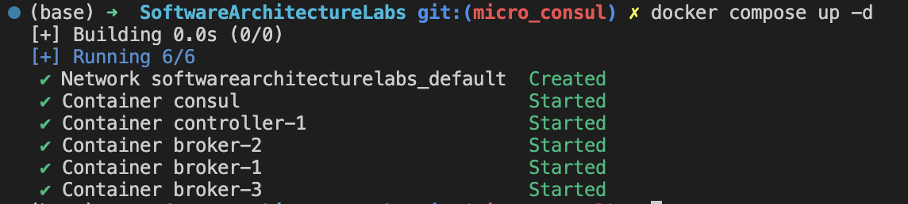
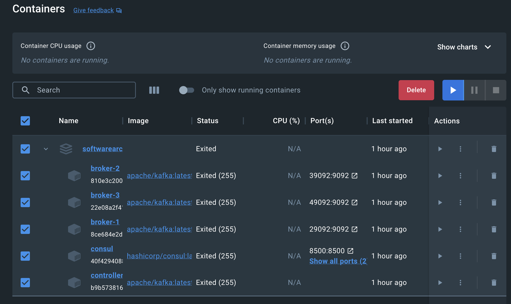

```bash
docker exec -it broker-1 /opt/kafka/bin/kafka-topics.sh --create \
  --bootstrap-server broker-1:19092,broker-2:19092,broker-3:19092 \
  --replication-factor 3 \
  --partitions 1 \
  --topic messages
```

## Starting all services

Use the included startup script to launch everything:
**Note**: Make sure the ```hazelcast-5.5.0``` directory is in the same workspace.

```bash
./start_services.sh
```

This script starts the following services:
- `facade-service`
- **three instances** of `logging-service`, each instance has its own **Hazelcast** node.
- **two instances** of `messages-service`.

## Registering All Services

After registering all services, the following steps and results are achieved:

- **Kafka MessageQueue and Hazelcast Key-Value Pairs**

  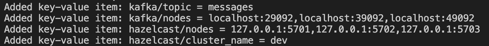

- **Service Registration Overview**

  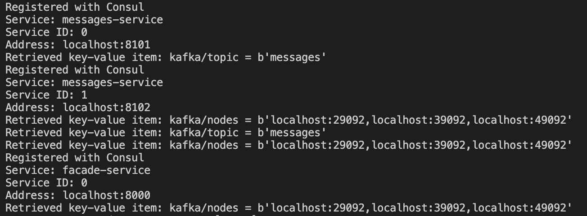

  

Once the services are registered, they can be discovered via Consul. This enables other services to locate and connect to them easily.

  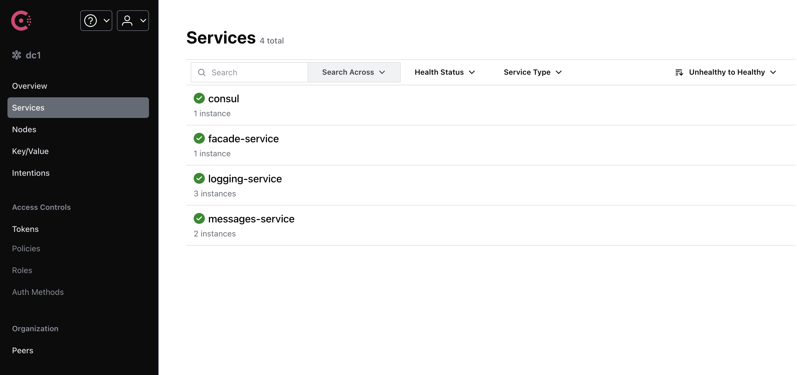

  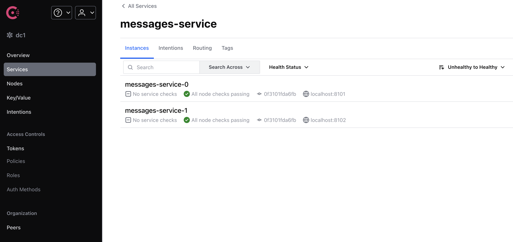

  

After registering the services, the system also manages key-value data in Kafka and Hazelcast. This allows for efficient data exchange and persistence across the system.

- **Kafka Key-Value Pair Storage**

  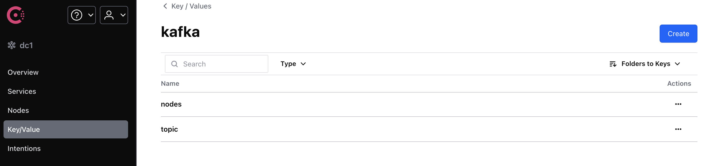

- **Hazelcast Key-Value Pair Storage**

  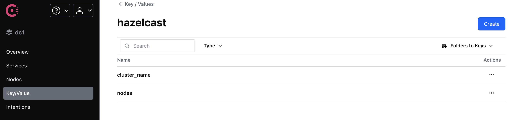

## GET and POST requests

Below are the results demonstrating successful **POST** and **GET** request handling:

**POST Request:**
- Message sent
- Message added to the queue

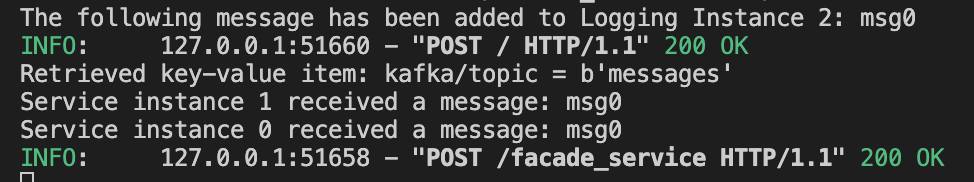
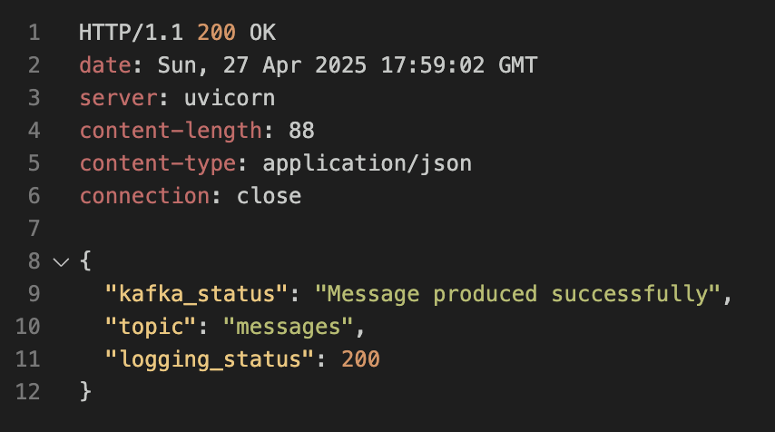

**GET Request:**
- Message retrieval
- Retrieved message result

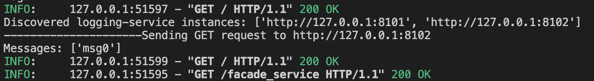
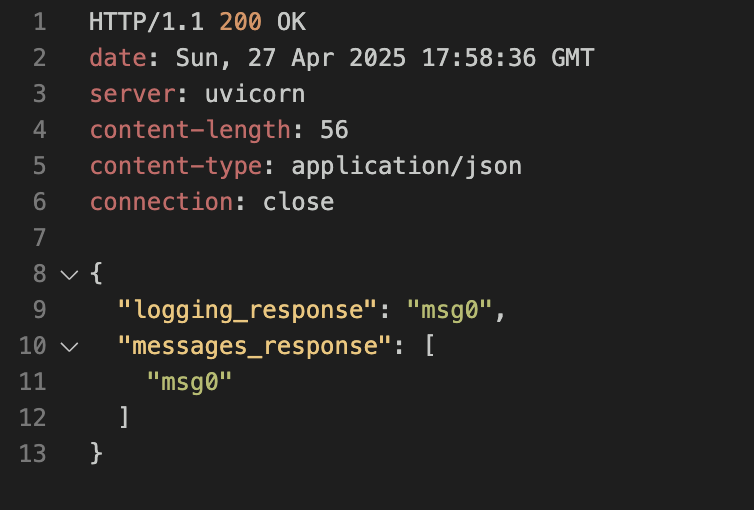

## Disabling a Service

I manually disabled the **Logging service (instance 1)** using `lsof` and `kill` commands.  
After termination, the service was automatically **deregistered from the Consul UI**.  
Despite this, **GET** requests continued to function as intended.

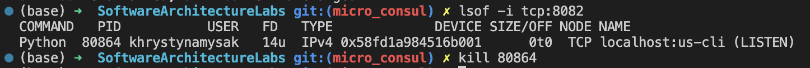
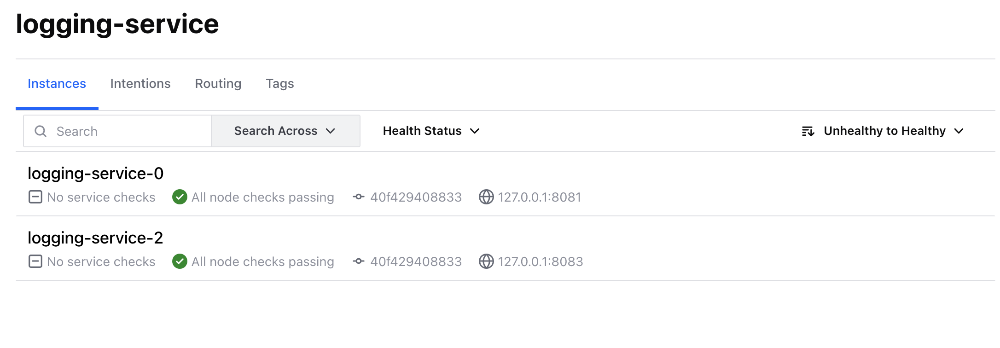
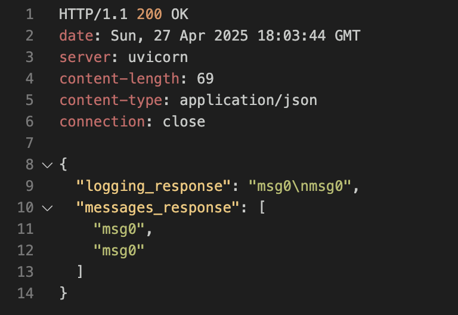
