# Software Architecture Labs: Hazelcast

## Task 1: Installation

To install the Python client, run the following command:

```sh
pip install hazelcast-python-client
```

Additionally, download Hazelcast Open Source from the official website:
[Hazelcast Download](https://hazelcast.com/community-edition-projects/downloads/).

---

## Task 2: Configure and Run a 3-Node Cluster

### Step 1: Navigate to the Hazelcast Directory
```sh
cd path/to/hazelcast
```

### Step 2: Start 3 Nodes in Separate Terminals
Run the following command in three separate terminals:

```sh
bin/hz start
```

### Terminal Output for Each Node
- **Node 1**
  
  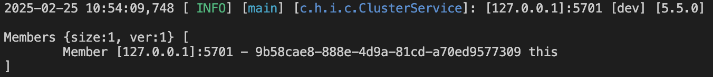
- **Node 2**
  
  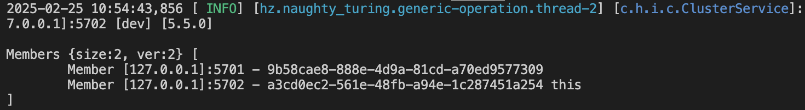
- **Node 3**
  
  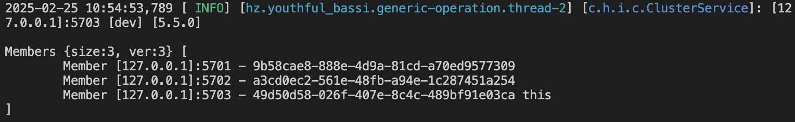

### Step 3: Check Cluster State
```sh
bin/hz-cli --config config/hazelcast-client.xml cluster
```

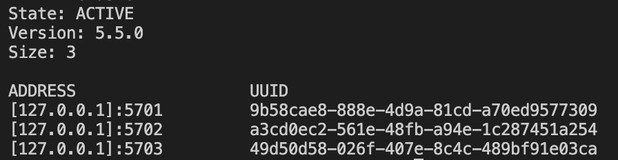

### Step 4: Start Hazelcast Management Center
```sh
management-center/bin/hz-mc start
```

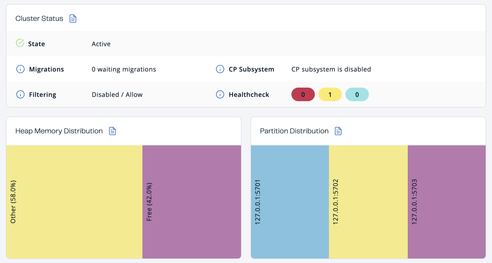

---

## Task 3: Distributed Map

### Implementation
A distributed map was created in `distributed_map.py` using a file containing random English words.

### Results
- **Initial Data Distribution**
  
  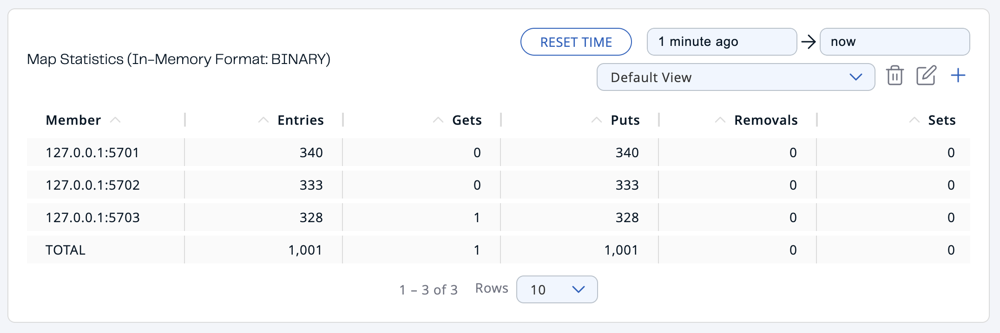
- **Example of Retrieval in Terminal**
  
  

### Fault Tolerance Experiments
- **Single Node Shutdown**
  
  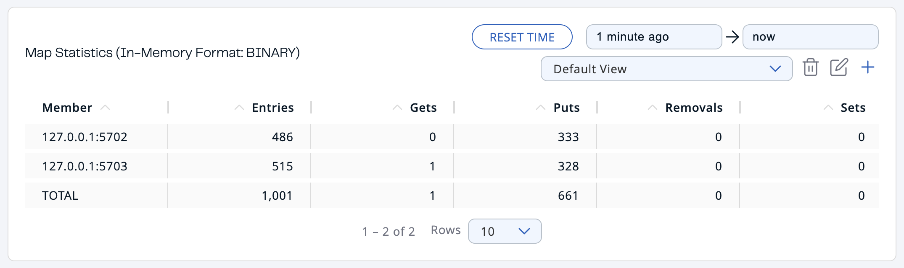
- **Sequential Shutdown of Two Nodes**
  
  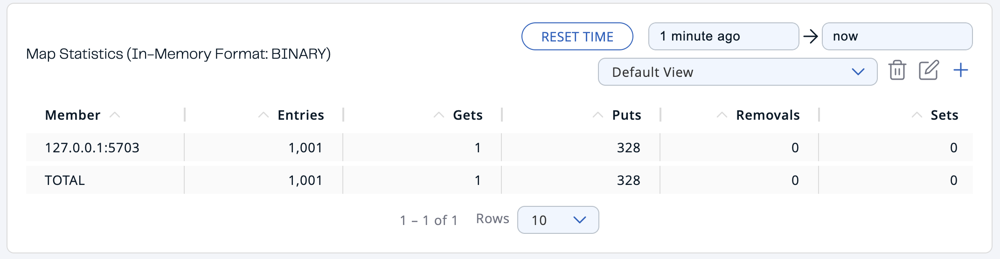
- **Simultaneous Shutdown of Two Nodes (`kill -9`)**
  
  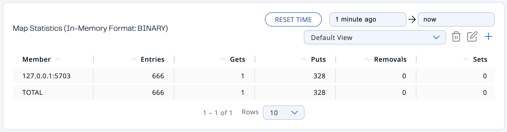

### Observations
- **Data Loss:** Approximately 1/3 of the data was lost when shutting down two nodes simultaneously.
- **Reason:** The reason for such data loss can be behind Hazelcast's Backup Model — Hazelcast stores data using a primary-backup model. If primary and backup nodes go down simultaneously, data is lost.
- **Prevention Methods:**
  - **Increase Replication Factor**: Ensures multiple backups exist.
  - **Enable Persistence**: Saves data to disk using MapStore.

---

## Task 4: Distributed Map Without Locks

Due to the lack of synchronization mechanisms, simultaneous read/write operations lead to race conditions. This results in incorrect values, typically lower than expected.

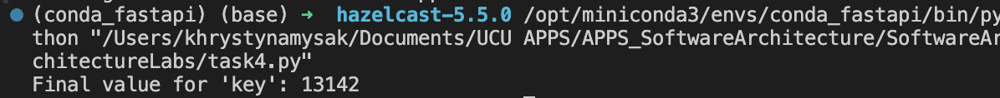

**Solution:** Implement locking mechanisms or atomic operations to ensure synchronization.

---

## Task 5: Pessimistic Locking
Implementation is in file `pessimistic_lock.py`.

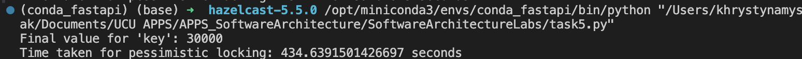

---

## Task 6: Optimistic Locking
Implementation is in file `optimistic_lock.py`

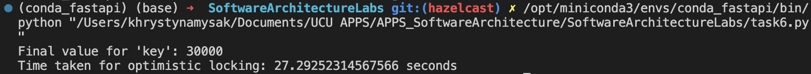

---

## Task 7: Results Comparison

| Lock Type          | Result | Time Taken (s) |
|-------------------|--------|---------------|
| **Without Lock**  | 13,142 | -             |
| **Pessimistic Lock** | 30,000 | 434.6         |
| **Optimistic Lock**  | 30,000 | 27.3          |

### Analysis
- **Without Lock:** Significant data loss (~50%) due to race conditions.
- **Pessimistic Lock:** Ensures full data consistency but significantly increases execution time.
- **Optimistic Lock:** Achieves full consistency with much better performance than pessimistic locking.

As the documentation of Hazelcast claims:
- Optimistic locking is better for mostly read-only systems. It has a performance boost over pessimistic locking.
- Pessimistic locking is good if there are lots of updates on the same key. It is more robust than optimistic locking from the perspective of data consistency.

---

## Task 8: Bounded Queue


---
