# SoftwareArchitectureLabs: Message Queues

This repository contains an enhanced implementation of a basic microservices architecture, integrating a Hazelcast distributed map and Kafka message queues.

## 🐳 Launching Kafka with Docker

To launch Kafka with Docker, create a `docker-compose.yml` file configured to run **3 Kafka brokers**.

### Commands:
```bash
docker-compose up -d
docker pull apache/kafka
```

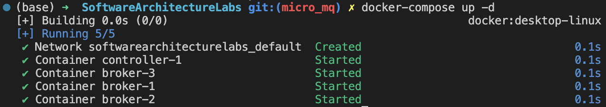
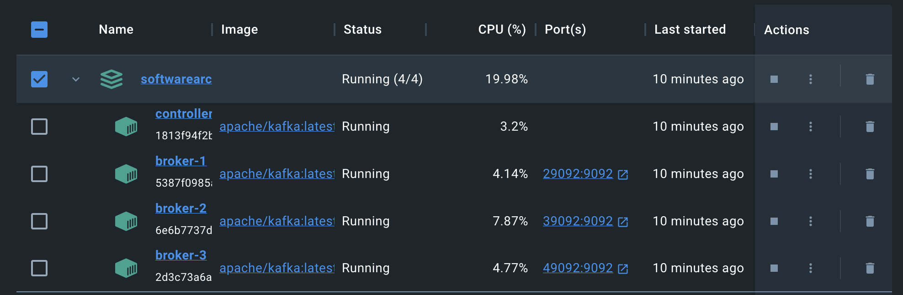

```bash
docker exec -it broker-1 /opt/kafka/bin/kafka-topics.sh --create \
  --bootstrap-server broker-1:19092,broker-2:19092,broker-3:19092 \
  --replication-factor 3 \
  --partitions 1 \
  --topic messages
```

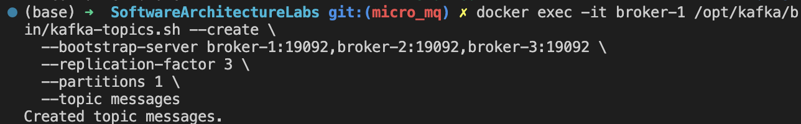

## Starting all services

Use the included startup script to launch everything:
**Note**: Make sure the ```hazelcast-5.5.0``` directory is in the same workspace.

```bash
./start_services.sh
```

This script starts the following services:
- `facade-service`
- `config-service`
- **three instances** of `logging-service` (locally on different ports), each instance has its own **Hazelcast** node.
- **two instances** of `messages-service` (locally on different ports).

## Adding messages

Firstly, I checked the GET request result before posting anything:

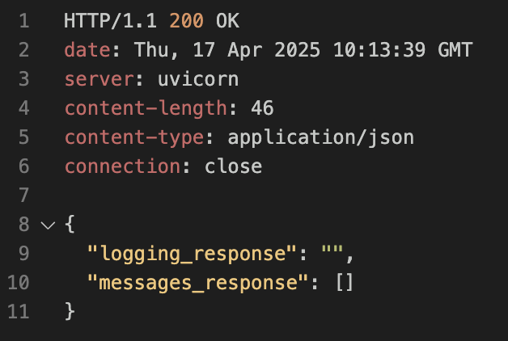

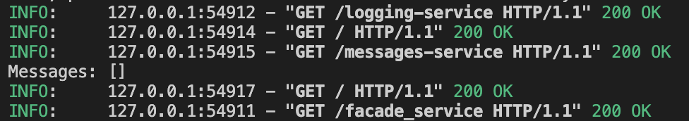

Next, I posted the first message:

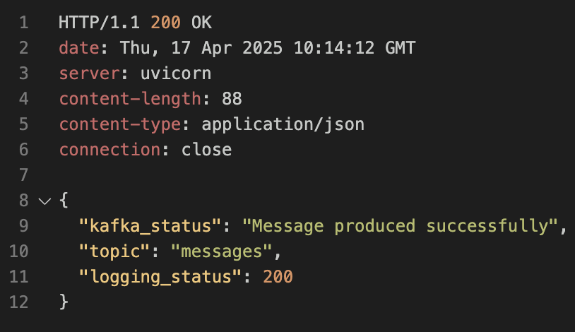

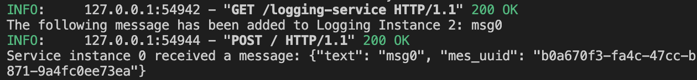

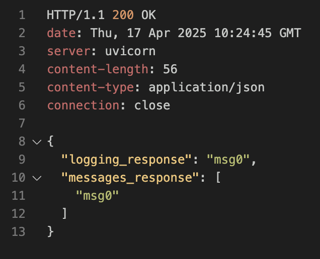

Finally, I tried adding 10 messages in a batch, and it can be seen that all messages were processed and different instances of logging received them:

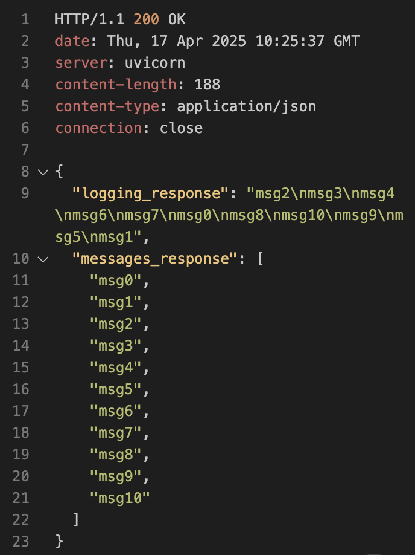

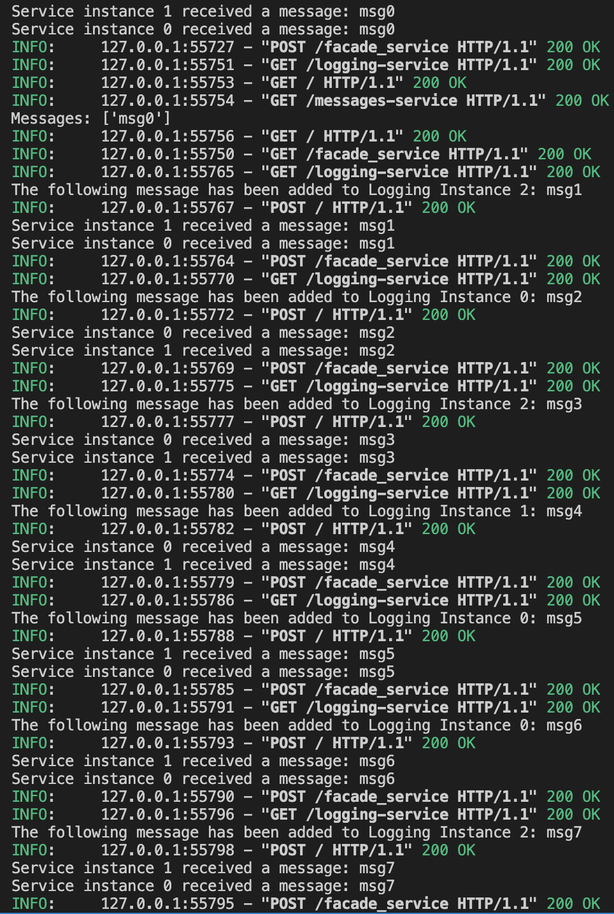

## 🔍 Checking Fault Tolerance

1. **Stop both instances** of the `messages-service` to ensure that messages are not consumed right away.

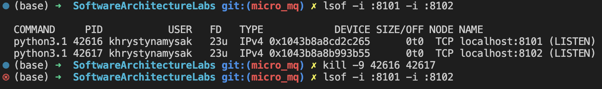

2. **Send a batch of messages** (e.g., 10 or 100) through the `facade-service`. These messages should remain in the message queue until the consumers are back online.

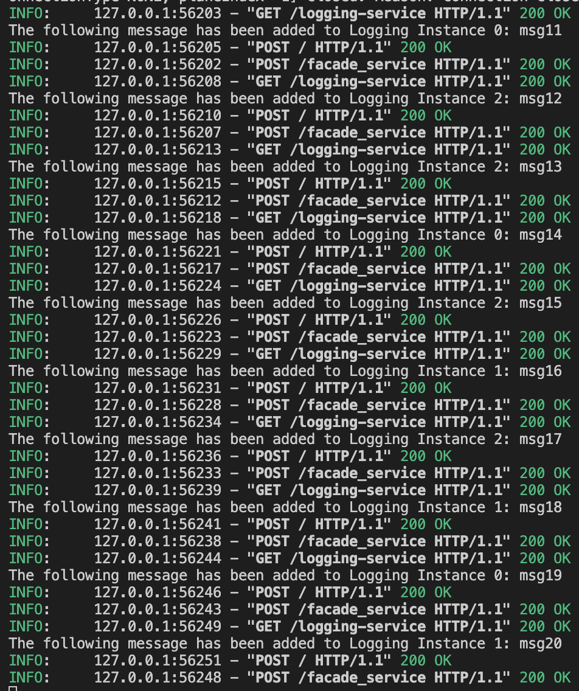

3. **Shut down one of the message queue servers**, specifically the **Kafka Leader**.

    To identify the current **Leader** for the topic, run:

    ```bash
    docker exec -it broker-1 /opt/kafka/bin/kafka-topics.sh --describe \
      --bootstrap-server broker-1:19092 \
      --topic messages
    ```

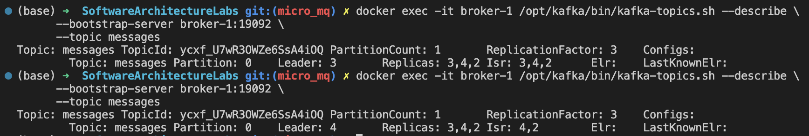

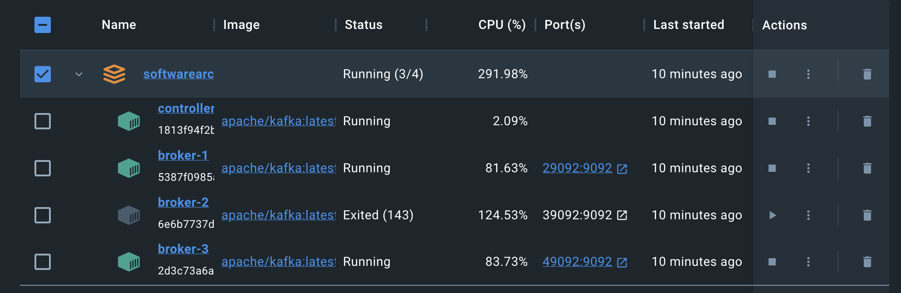

4. **Restart the `messages-service` instances** and **verify** in their logs that all previously sent messages were correctly received and processed from the queue.

All the messages were processed and added.

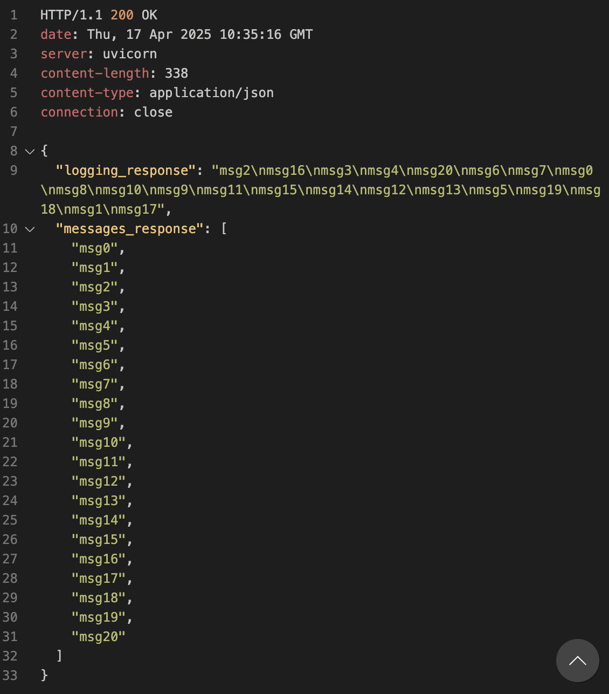
