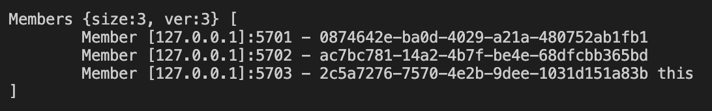
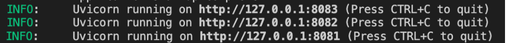
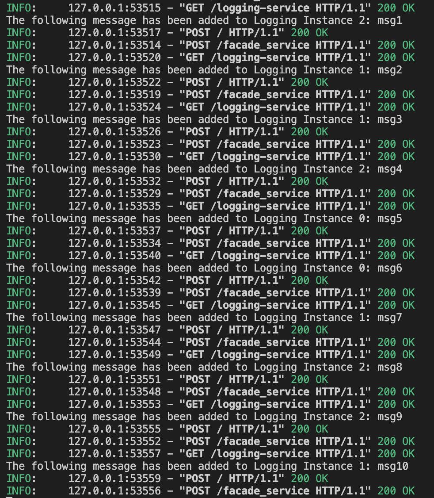
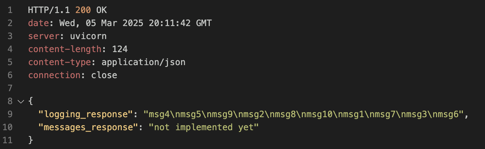
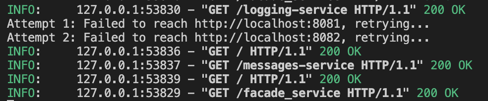
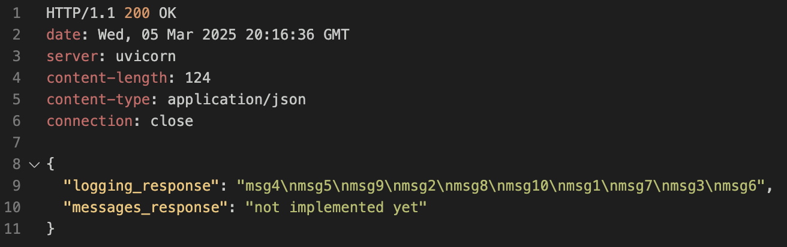
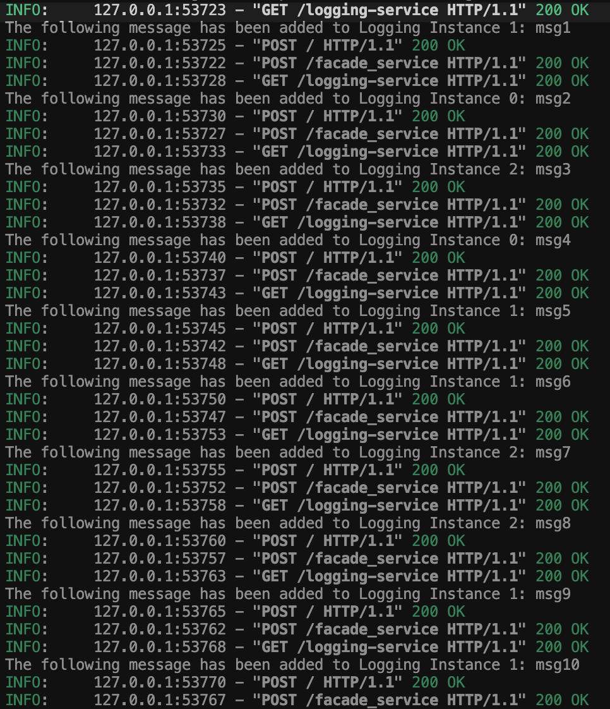

# SoftwareArchitectureLabs

This repository contains an improved implementation of a basic microservices architecture with an incorporated Hazelcast distributed map.

---

## Tasks and Results

### 1. Start Three Instances of Logging-Service (with Three Hazelcast Nodes)

The system initializes three instances of the logging service, each running on a separate Hazelcast node.

#### Nodes:

#### Logging Services:

---

### 2. Write 10 Messages via `facade-service` Using HTTP POST

Messages are distributed across the three logging service instances:

- **Instance 0**: 2 messages
- **Instance 1**: 5 messages
- **Instance 2**: 3 messages

#### Post Result:

---

### 3. Retrieve Messages via `facade-service` Using HTTP GET

All messages are successfully retrieved from the Hazelcast distributed map.

#### Get Result:

---

### 4. Shutdown One/Two Instances of Logging Service (With Hazelcast Nodes) and Verify Data Availability

Even after shutting down two logging service instances along with their corresponding nodes, all messages remain accessible in the distributed map.

#### Logs After Shutdown:

#### Get Result After Shutdown:

---

## Additional Implemented Features

- **Config Server**  
  Configuration requests are logged and can be observed in the log images above.

  
